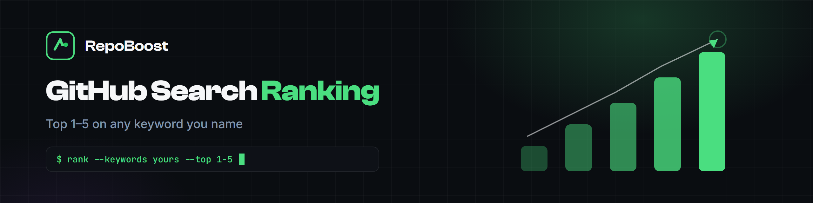

  

  

  
  
  
  
  
  

# GitHub Search Ranking - Top 1-5 on Any Keyword You Name

GitHub search is where developers look first. This service places your repository in the top 1-5 results for the keywords you choose - globally, not just in one region - and it holds there. This repository is both the documentation of that service and a practical guide to how GitHub search ranking actually works.

Inside: the signals GitHub weighs, how keyword selection is done, what Top 1-5 placement means for a repository, and why most repositories never show up in search at all. Written for developers and teams who want their repository found by the people searching for what it does.

## ✨ How the service works

1. **You name the keywords.** Pick the terms your users would search for, or ask for suggestions - we help choose terms that are winnable and relevant.
2. **We optimize the repository.** Name, description, topics, README content and engagement signals are aligned with the target terms.
3. **Your repo holds Top 1-5.** Placement is global, monitored, and verified with demos of achieved ranks on request.

No one outranks you for your chosen terms. Search ranking is a separate service from the stars packages - quoted per keyword, depending on difficulty and volume.

## 🧠 What affects GitHub search ranking

| Signal | How it works |
|---|---|
| **Repository name** | Strongest text-match signal - the exact phrase matters |
| **Description** | The About one-liner, indexed and shown in results |
| **Topics** | GitHub's search filters - under 5 topics you are absent from filtered searches |
| **README content** | Full-text indexed; first 200 words carry the most weight |
| **Stars & forks** | Engagement decides position once text relevance qualifies you |
| **Recent activity** | Commits, issues and PRs in the last ~90 days |

GitHub does not publish exact weights. Text relevance gets a repository into the candidate pool; engagement decides where it lands inside that pool. The first hundred stars change the most; after that, ranking compounds.

## More about GitHub search

### Who this is for

- **Developers launching a project** who want it found from day one
- **Agencies** ranking client repositories for competitive keywords
- **Maintainers** whose repository is buried under older, better-known projects

### What Top 1-5 actually means

For the keywords you choose, your repository appears in the top 1-5 search results globally - not in one region, and not on page two where almost nobody clicks. Search placement is also the only signal that keeps working after delivery: ranking brings visitors, visitors bring stars, and stars reinforce ranking.

### Why is my repo not showing in GitHub search?

Almost always one of three mechanical problems: an empty description, missing topics, or a name that does not match any query people actually type. All three are fixable in an afternoon - and all three are part of what ranking optimization covers.

### Keywords: how to choose

Two to four terms work best. Pick the phrase your users would type, check what currently ranks for it, and choose terms you can realistically own. We help with the research and tell you honestly which terms are winnable.

### Honest notes

Timelines depend on the keyword's difficulty and competition. GitHub can change its ranking systems at any time - no provider controls that. What we do control: the optimization work, the monitoring, and the proof. Achieved ranks are demonstrated on request.

  

## ❓ FAQ

**Why is my repo not showing in GitHub search?**

Usually an empty description, missing topics, or a name that does not match what people search for. Fix those three first - they are free and immediate - and the repository starts appearing for its own name and description keywords.

**What are the GitHub search ranking factors?**

Text signals: repository name, description, topics and README content. Engagement signals: stars, forks, watchers and recent activity. Text relevance gets you into the candidate pool; engagement decides your position inside it. GitHub does not publish exact weights.

**How do I rank higher in GitHub search?**

Align the name, description and topics with the exact phrases people type, keep the README substantial, stay active - and build engagement on the terms that matter. For competitive keywords, that last part is what Search Ranking as a service handles.

**How long does ranking take?**

Keyword selection, optimization and monitoring are part of the service; timelines depend on the term's difficulty and competition. You get honest estimates per keyword before you commit.

**What does Top 1-5 actually mean?**

Your repository appears in the top 1-5 results for the keywords you choose, globally - not in one region, and not on page two. Placement is monitored and demonstrated on request.

**Which keywords should I target?**

Two to four terms your users would actually type. We help choose terms that are relevant and winnable, and we will tell you when a keyword is too competitive to promise.

**Is search ranking included in the stars packages?**

No - search ranking is a separate service, quoted per keyword. Stars packages cover engagement; ranking covers search placement for chosen terms.

**Do you show proof of achieved ranks?**

Yes. Demos of achieved ranks are available on request - live search results for the keywords that were targeted.

## Related

- [Buy GitHub Stars](https://github.com/repoboost-hq/buy-github-stars) - real stars from aged accounts, delivered gradually
- [github-ranking-audit](https://github.com/nMaas8388/github-ranking-audit) - open-source tool that scores a repo's ranking signals

More from the org: [github.com/repoboost-hq](https://github.com/repoboost-hq)

## Further reading

- [GitHub SEO: How to Make Your Repository Rank in Search](https://buygithub.com/blog/github-seo-rank-repository/?utm_source=github&utm_medium=readme&utm_campaign=github-search-ranking)

---

  <b><a href="https://buygithub.com/github-search-ranking/?utm_source=github&utm_medium=readme&utm_campaign=github-search-ranking">🌐 buygithub.com</a></b> &nbsp;|&nbsp;
  <a href="https://github.com/repoboost-hq">🧰 More from the org</a>

Independent service. Not affiliated with GitHub, Inc.

